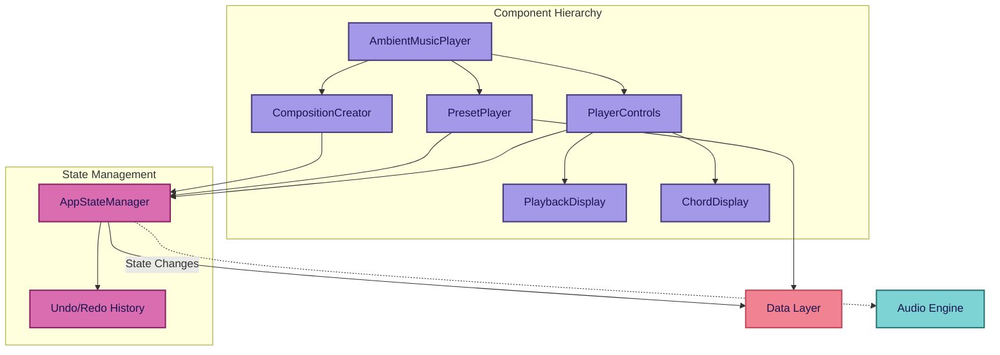
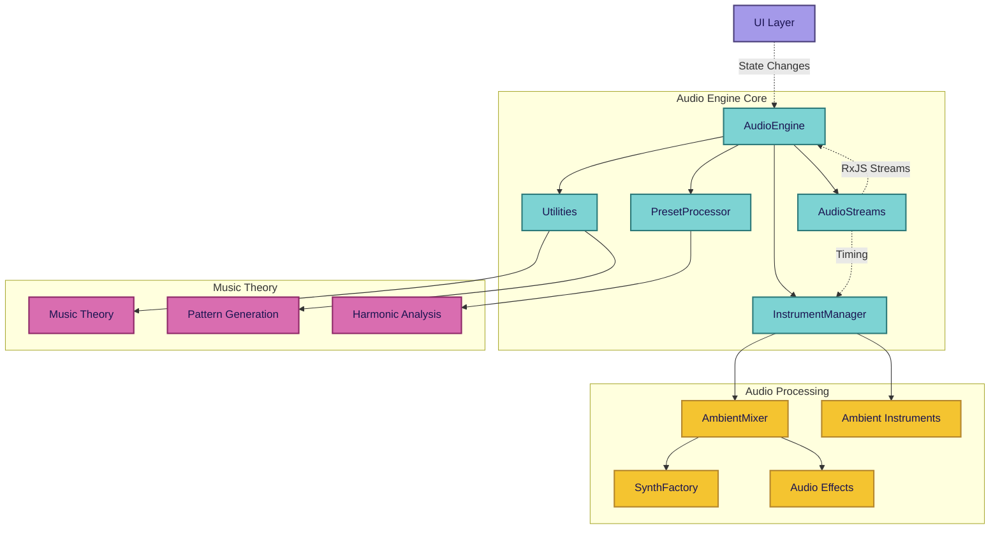

# Ambiente

Reactive ambient music generator built with SvelteKit 5, RxJS, and Tone.js. Creates generative ambient music through reactive audio programming and real-time parameter automation.

## Features

### Generative Music System

- Real-time ambient music generation with multiple instrument types
- Reactive (rxjs + runes) chord progressions with automatic harmonic movement
- Pattern-based and continuous texture instruments
- Advanced audio effects including convolution reverb and granular processing

### Controls

- Real-time parameter adjustment with immediate audio feedback
- Preset library with thematic categorization and instant loading
- Live playback monitoring with visual chord and instrument tracking
- Intuitive transport controls with keyboard shortcuts

### Reactive Architecture

- RxJS-powered audio engine with declarative stream programming
- Modular instrument system supporting both sequenced and ambient textures
- Comprehensive music theory integration for intelligent harmonic content
- Component-based UI with prop-specific state management

### Audio Processing

- Web Audio synthesis using Tone.js with custom effect chains
- Advanced signal routing through AmbientMixer architecture
- Real-time parameter automation and smooth transitions
- Professional audio effects including tape saturation and spectral processing

## System Design

### UI Architecture



### Audio Engine Architecture



### Core Architecture

Built on reactive programming principles using RxJS streams for audio timing and state management. The modular audio engine coordinates specialized components while maintaining clean separation of concerns.

### Component Hierarchy

Prop-based component architecture eliminates state object passing anti-patterns. Each component receives specific data and callbacks, ensuring clear data flow and easy testing.

### Audio Engine

Modular reactive system combining pattern-based instruments with continuous ambient textures. Supports real-time parameter changes and automatic harmonic adaptation.

### State Management

AppStateManager coordinates application state with undo/redo history. Audio engine reacts to state changes via RxJS streams while components receive targeted props.

## Development

### Prerequisites

```sh
pnpm install
```

### Development Commands

```sh
pnpm dev          # Start development server
pnpm check        # Type checking
pnpm lint         # ESLint linting
pnpm test         # Run tests
```

### Production Build

```sh
pnpm build        # Build for production
pnpm preview      # Preview production build
```

## Stack

### Core

- SvelteKit 5 with static adapter (SPA mode) and runes-based reactivity
- TypeScript
- Tailwind 4

### Audio & Reactive Programming

- Tone.js 15
- RxJS 7
